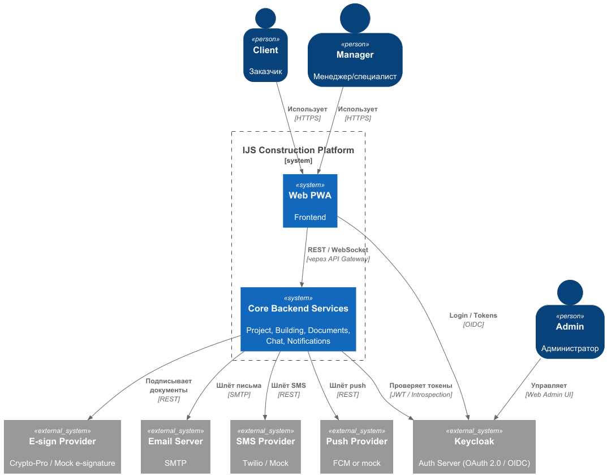
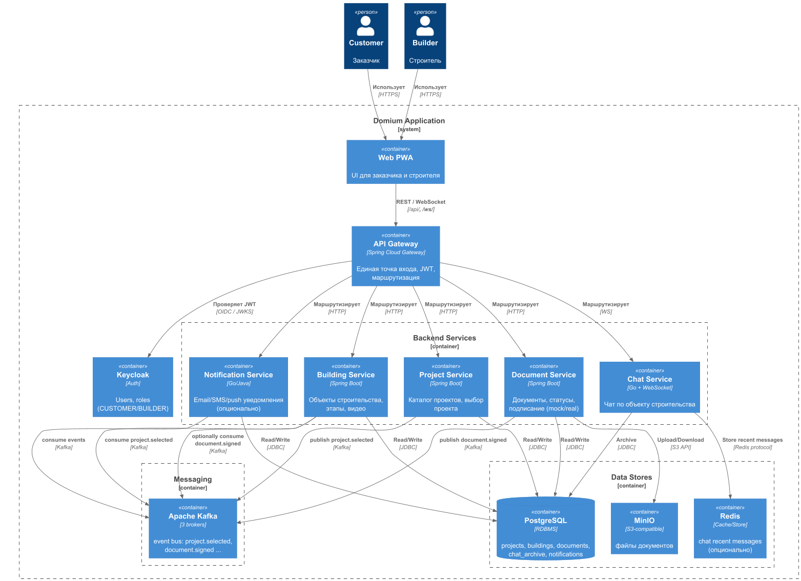

# DOMIUM APPLICATION

**Стек**: Java 21, Spring, Postgres, Redis, Minio, Docker Compose, Grafana + Prometheus + Loki, Keycloak.

---
### Содержание
- Архитектура
- Состав репозитория
- Быстрый старт
- Порты и сервисы
- Наблюдаемость
- Тестирование
---
### Архитектура
### Диаграммы архитектуры (C4 + PlantUML)

PlantUML схемы находятся в `docs/`:
- **Context (уровень системы)** - [docs/context.puml](docs/context.puml)

  

- **Container (уровень контейнеров)** - [docs/containers.puml](docs/containers.puml)

  

---
### Состав репозитория
```
domium/
├── services/                бэкенд
│   ├── api-gateway/
│   ├── project-service/
│   ├── domium-building/
│   ├── document-service/
│   ├── chat-service/
├── domium-ui/                фронтенд
├── infra/                    конфигурации Grafana/Prometheus/Tempo/Loki/Keycloak и инициализация бд.
├── docs/                     диаграммы
├─ docker-compose.yaml        инфраструктура + сервисы
```

---
### Быстрый старт
> Требуется: **Docker** (compose), **JDK 21** (если запускать сервисы локально из IDE).
> Порты по умолчанию: 8081 (Keycloak), 8090 (API Gateway), 8091 (Building Service), 8092 (Document Service), 9090 (Prometheus), 3000 (Grafana), 3100 (Loki), 3001 (Domium UI).

   ```bash
   docker compose up -d
   ```
   запуск со сборкой сервисов:

```bash
    docker compose up --build -d
   ```
---

2. **Запуск сервисов из IDE/CLI (локально, без Docker)**

    * Building Service (domium-building):

      ```bash
      cd services/domium-building
      ./gradlew :app:bootRun   # порт 8091
      ```

---
### Сервисы

| Сервис             | Порт (host) | Описание                     | Адрес                  |
|--------------------|-------------|------------------------------|------------------------|
| Domium UI          | 3001        | Контейнер `domium-ui`        | http://localhost:3001/ |
| API Gateway        | 8090        | Gateway                      | http://localhost:8090/ |
| Keycloak           | 8081        | Dev-мод                      | http://localhost:8081/ |
| Postgres           | 5432        | Контейнер `postgres`         |                        |
| Building Service   | 8091        | Контейнер `domium-building`  |                        |
| Document Service   | 8092        | Контейнер `document-service` |                        |
| Consul             | 8500        | Service Discovery            | http://localhost:8500/ |
| Redis              | 6379        | Кеширование                  |                        |
| Redis insight      | 5540        | ui                           | http://localhost:5540/ |
| Prometheus         | 9090        | Метрики                      | http://localhost:9090/ |
| Grafana            | 3000        | Dashboard + Explore          | http://localhost:3000/ |
| Loki               | 3100        | Хранилище логов              |                        |
| Minio              | 9000        | Хранилище документов + Loki  | http://localhost:9001/ |

---

### API Документация (Swagger)

- **Агрегированная документация всех сервисов**: 
  - Swagger UI: http://localhost:8090/swagger-ui.html
  - OpenAPI JSON: http://localhost:8090/v3/api-docs/aggregated

### Авторизация в Swagger UI

Для выполнения запросов к защищенным API:
1. Получите JWT токен из Keycloak (см. [API Gateway README](services/api-gateway/README.md#авторизация-в-swagger-ui))
2. В Swagger UI нажмите кнопку **"Authorize"** и введите токен
3. Все запросы будут выполняться с авторизацией


Prometheus уже сконфигурирован на сбор `/actuator/prometheus`. Grafana **автопровиженит** датасорсы Prometheus/Loki/Tempo.

---

### Наблюдаемость

* **Метрики**: `http://localhost:8090/actuator/prometheus`
* **Prometheus**: `http://localhost:9090`
* **Grafana**: `http://localhost:3000` (admin/admin). Датасорсы Prometheus/Loki провиженятся из `infra/grafana/provisioning`.
* **Логи**: Loki развёрнут; для доставки логов приложений используйте promtail или logback‑аппендер для Loki (в репозитории базовая конфигурация Loki уже есть).
---

### Тестирование

todo

---
